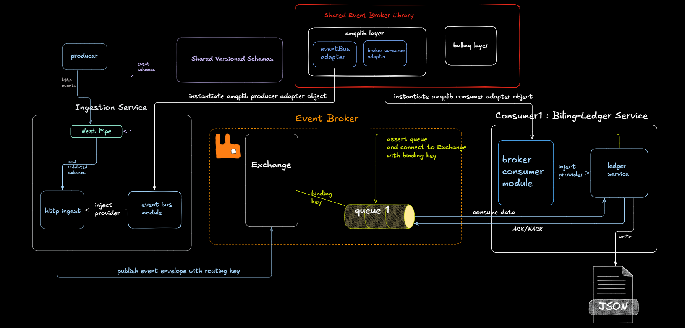

<div align="center">

  # LUMEN EIP – Event Ingestion Platform
  
 
</div>


---


LUMEN EIP is a distributed event ingestion and processing platform designed to explore and implement reliable event-driven communication paradigms between microservices.

The system is built by abiding the principles of Event Driven Architecture with a strong emphasis on message delivery semantics, failure handling, and controlled processing guarantees, rather than just functional correctness. It incrementally evolves toward production-grade patterns by explicitly addressing edge cases such as duplicate delivery, consumer crashes, and message acknowledgment boundaries.

## Overview
In a microservices architecture, services must communicate while preserving correctness, scalability, and fault isolation. Henceforth , communications between services in such a setup may be Synchronous or Asynchronous, both comes with their own tradeoffs. Asynchronous Communication or delayed communication comes with its own set of challenges like duplicate processing of events, events getting lost, consumer failing at different stages of acknowledging to producer. Naive implementation can often tend to ignore these, which results in systems which may look functional but may not scale and perform under real world operating conditions. 
LUMEN EIP is built to address these challenges , by designing an architecture which decides wisely the communication pattern between services, makes them fault tolerant and resilient by implementing appropriate event delivery semantcs, Event persistent strategies, acknowledgement semantics, and code scaffolding patterns. However , there are tradeoffs and practical situations where the functioning of the system can be discussed. 

## System Architecture

At a high level, LUMEN EIP follows a producer–broker–consumer model:

```bsh
┌───────────────┐     ┌────────────────────────────┐     ┌───────────────────────┐     ┌──────────────|
│   Producers   │ ──► │      Ingestion Service     │ ──► │ Message Broker        │ ──► │   Consumers  |
└───────────────┘     └────────────────────────────┘     │                       │     └──────────────┘
                                                         └──────────-────────────┘            
                                                                                             
                                                                    
```
This flow establishes asynchronous, decoupled communication between services while enabling controlled message processing and failure handling.

### Component functionality
#### 1. Ingestion Service (`apps/ingestion-service`)
The entry point for all incoming data, ensuring it is sanitized and standardized. The Ingestion service must be deisgned to acheive a high **Throughput** in order to be able to handle masssive amount of incoming events.
* **HTTP Endpoint:** Accepts events over standard HTTP protocols with specific APIs.
* **Schema Validation:** Validates structure against shared schemas to ensure data integrity.
* **Normalization and Preprocessing:** Normalizes events into a standard envelope for downstream consistency, along with some consumer specific preprocessing as needed.
* **Broker Publishing:** Publishes validated events directly to the message broker by using the implemented Broker Abstraction layer.

---

#### 2. Message Broker (RabbitMQ)  (`packages/common/broker`)
The central transport layer and communication medium in this System which promotes Asynchronous communication of events between services. It ensure loose coupling that manages communication between decoupled services.
* **Decoupling:** Acts as the central event transport layer, decoupling producers from consumers.
* **Asynchronous Processing:** Uses asynchronous processing to handle events, which enforces delayed but eventual consistency over the system.
* **Delivery Guarantees:** Provides at-least-once delivery semantics.
* **Manual Acknowledgments:** Enables explicit acknowledgment control (**ACK/NACK**) for reliable processing.

---

#### 3. Consumers
Each consumer is a separate Nest repo in itself, each with its own envs, utils, libs and core logic and service apis.
Independently deployed services responsible for the actual processing of events.
* **Isolation:** Services are independently deployed and scaled based on specific logic needs.
* **Data Ownership:** Each consumer owns it independent data , presistence models which leads to more robust evolution of services.

### HLD of Phase 1


## Base Event Contract
  ```bsh
      {
        eventId : uuid,
        domain : string,
        eventName :  string,
        version : number,
        producer : string,
        data : {}
     }

```

## Fault-Tolerant and Resilient Strategies

### 1. At-least once Delivery Semantics

The system follows the notion that the event delivery of the same published event from Broker to Consumer can be occur more than once. This is acheived by the Broker managed queues combined with manually implementated Acknowledgement. The following failure situation hasa been handled in this system:
* **Consumer crashes before processing**
    * → Message remains unacknowledged
    * → Broker redelivers to same or another consumer
* **Consumer crashes after processing and before ACK**
    * → Message is redelivered      
* **Processing failure (explicit NACK)**
    * → Message is requeued for retry
* **Consumer Down**
    * → Messages accumulate in the queue
    * → Processed once consumer resumes
 

> [!CAUTION]
> Must use some sort of Idempotency to handle duplicate processing of Events

### 2. Publisher Confirm

The system also uses Publisher Confirms to handle ACKNOWLEDGEMENTS from Broker ,so the Producer has the clear idea of event publishing status in the queue.
* **Broker unavailable during publish**
    * → Message is not acknowledged
    * → Producer can retry
* **Network failure during publish**
    * → No confirmation received
    * → Safe to retry
 

###  3. Manual ACK/NACK

  System uses Manual Acknowledgements to promote Consumer Delivery Acknowledgements. This ensure fault-tolerance and failure handling situations under the aforesaid situations and is the prime backbone to exhibit at least once semantics.
  - `ACK` from Consumer : Event removed from RAM of Broker, and from Disk if it was persistent.
  - `NACK` from consumer : Broker eitehr reques the event or drops it from the queue.

### 4.Idempotency

  Idempotency is a key strategy in desiging consumer logic as it enables a consumer to safely handle and process duplictae events from Broker replay or redelivery.
  It is a must have strategy in order to support At least Once Delivery. Without it , many functions or processing like payment update or DB deletes can be repeated leading to critical failure.

  >[!NOTE]
  > Currently the Systemn is using an in-memory set/map to store Events that has been processed by the Consumer. The events are stored in the form of tneir unique `event.id`.
>


## Build and Run
> This project uses pnpm for dependency management and workspace handling.Other package managers (npm, yarn) are not officially supported and may lead to inconsistent dependency resolution in the monorepo setup.Please ensure pnpm is installed before proceeding.

### Required
  - `Node.js` (v18 or higher)
    Required to run all backend services
    
  - `pnpm`
    Package manager used for dependency and workspace management in the monorepo
> Install globally if not already available

- `RabbitMQ`
  Ensure Rabbit MQ is running either locally or on Docker

  Docker Command to run Rabbit MQ
  ```bash
      docker run -it
      --rm --name rabbitmq
      -p 5672:5672 -p 15672:15672
      rabbitmq:4.0-management
  ```

  amqp_domain : `amqp://localhost:5672`

  For viewing analytics, visit the RabbitMQ Management UI can be visited at : `amqp://localhost:5672`
  Default credentials: `guest / guest`

  ### Run the ingestion service
  ```bsh
      cd apps/ingestion-service
      pnpm install
      pnpm run start:dev
  ```

  By running this the Ingestion Service kicks off. As the Event Ingest APIs are hit by the producer with raw JSON events, the service serializes it and validates the schema of the incoming event against Zod Schema. It forwards it to the required service , and passes the enveloped Event Data to the safe Publish function of the AQMP abstracted layer. Finally the Broker (if up and running) will publish it to the required Exchange, and send acknowledgment back to the Publisher , which is then gracefully handled by the Publisher logic.


## Current Limitations and Future Prospects 

The current phase focuses on establishing the core foundational layer of an system following EDA with within a microservice ecosystem, with delivery guarantees and message flow correctness. The following areas are intentionally fully implemented yet and will be addressed in upcoming phases:

* **Retry Strategies with Backoff**
   
* **Dead Letter Queue (DLQ)**

* **Persistent Idempotency**

* **Observability**

* **Scalability of Consumers**

* **Durable Event Storage**

* **Schema Evolution Handling**

* **Exchange Without Bound Queues**


    

  
